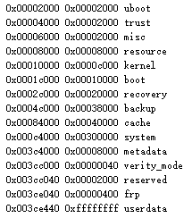

# 备份系统

## 参考

* <https://www.right.com.cn/forum/thread-3015470-1-1.html>

## 备份操作


## rk3399-evb





```
0x00002000 0x00002000 uboot
0x00004000 0x00002000 trust
0x00006000 0x00002000 misc
0x00008000 0x00008000 resource
0x00010000 0x0000c000 kernel
0x0001c000 0x00010000 boot
0x0002c000 0x00020000 recovery
0x0004c000 0x00038000 backup
0x00084000 0x00040000 cache
0x000c4000 0x00300000 system
0x003c4000 0x00008000 metadata
0x003cc000 0x00000040 verity_mode
Ox003cc040 0x00002000 reserved
0x003ce040 0x00000400 frp
0x003ce440 0xffffffff userdata
```


---
